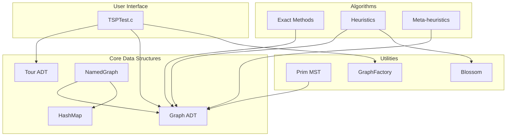
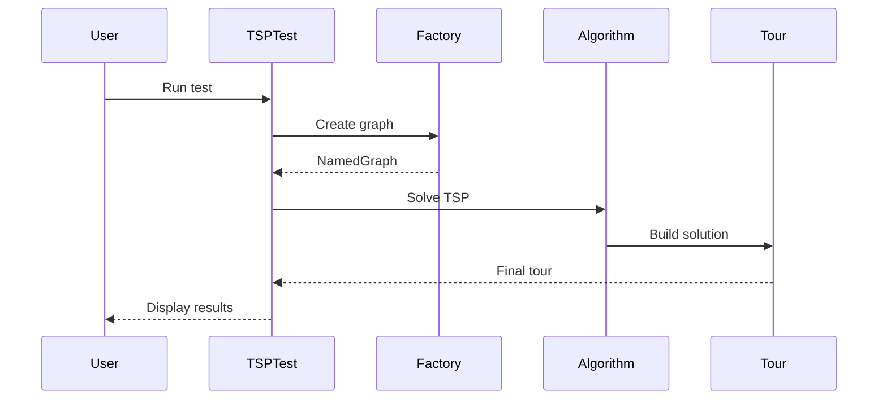
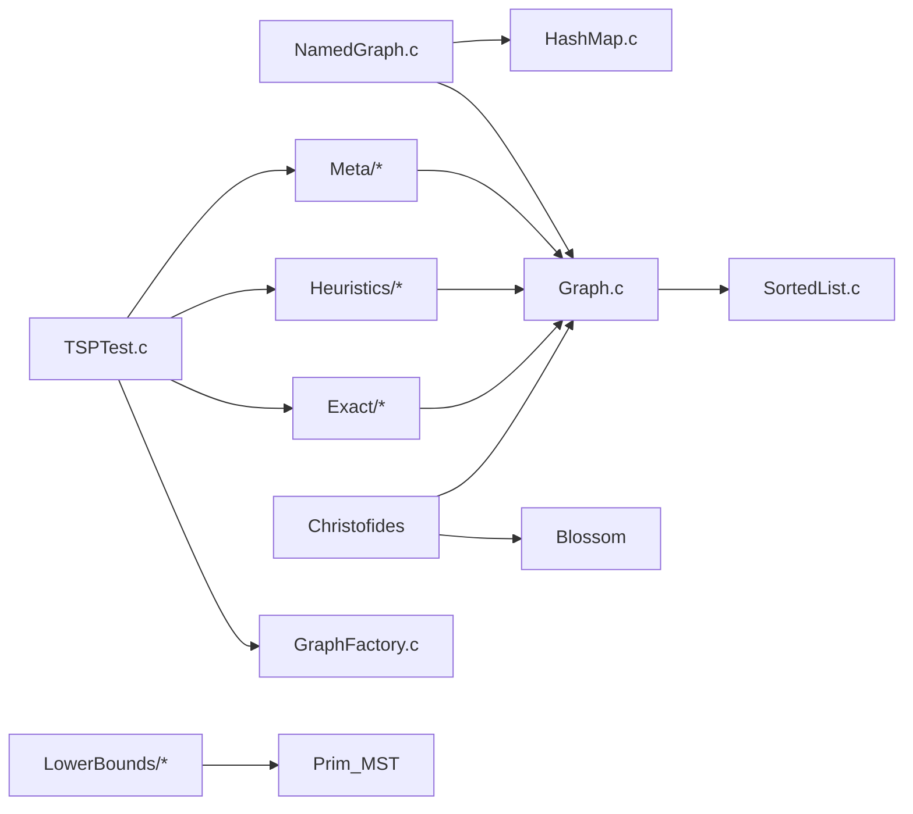

# TSP Project Architecture

## System Overview

```mermaid
graph TB
    subgraph "User Interface"
        A[TSPTest.c]
    end
    
    subgraph "Core Data Structures"
        B[Tour ADT]
        C[Graph ADT]
        D[NamedGraph]
        E[HashMap]
    end
    
    subgraph "Algorithms"
        F[Exact Methods]
        G[Heuristics]
        H[Meta-heuristics]
    end
    
    subgraph "Utilities"
        I[Prim MST]
        J[Blossom]
        K[GraphFactory]
    end
    
    A --> B
    A --> C
    A --> K
    
    D --> C
    D --> E
    
    F --> C
    G --> C
    H --> C
    
    G --> J
    I --> C
```

## Data Flow

```mermaid
sequenceDiagram
    participant User
    participant TSPTest
    participant Factory
    participant Algorithm
    participant Tour
    
    User->>TSPTest: Run test
    TSPTest->>Factory: Create graph
    Factory-->>TSPTest: NamedGraph
    TSPTest->>Algorithm: Solve TSP
    Algorithm->>Tour: Build solution
    Tour-->>TSPTest: Final tour
    TSPTest-->>User: Display results
```

## Module Dependencies

```mermaid
graph LR
    Graph[Graph.c] --> SortedList[SortedList.c]
    NamedGraph[NamedGraph.c] --> Graph
    NamedGraph --> HashMap[HashMap.c]
    
    Exact[Exact/*] --> Graph
    Heuristic[Heuristics/*] --> Graph
    Meta[Meta/*] --> Graph
    
    Christofides[Christofides] --> Blossom[Blossom]
    Christofides[Christofides] --> Graph
    Bounds[LowerBounds/*] --> Prim[Prim_MST]
    
    Test[TSPTest.c] --> Factory[GraphFactory.c]
    Test --> Exact
    Test --> Heuristic
    Test --> Meta
```
---

For usage, see README.md