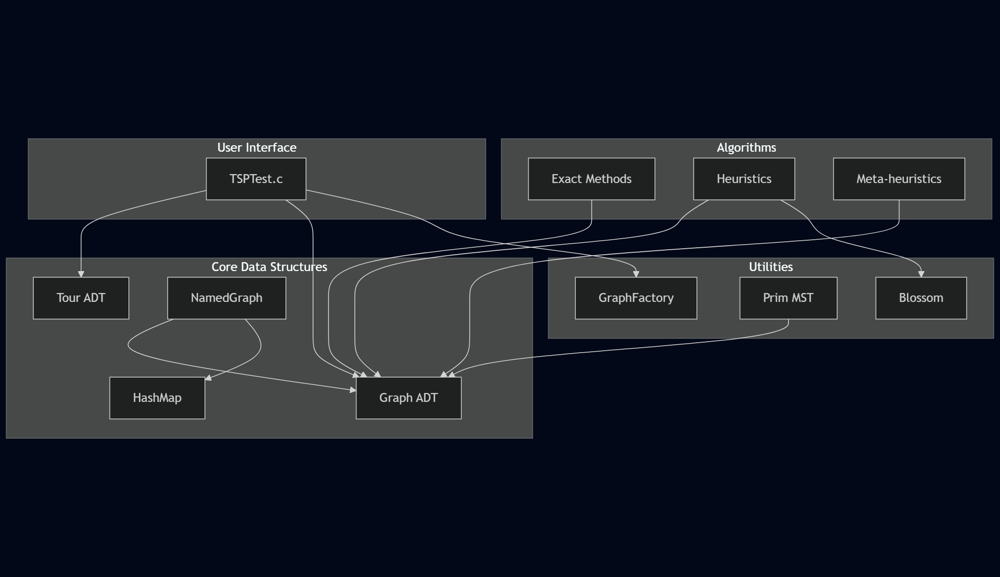

# TSP Solver

[](https://devdocs.io/c/)
[](https://github.com/nelsonramosua/TSP/blob/main/LICENSE)
[](https://github.com/nelsonramosua/TSP/actions)

An educational implementation of **algorithms** to solve the Traveling Salesman Problem, written from scratch in pure C.

---

## Links

- [GitHub Repository](https://github.com/nelsonramosua/TSP)
- [README]({{ "/README.html" | relative_url }})
- [Architecture]({{ "/ARCHITECTURE.html" | relative_url }})
- [Changelog]({{ "/CHANGELOG.html" | relative_url }})
- [Contributing Guide]({{ "/CONTRIBUTING.html" | relative_url }})
- [Report a Bug](https://github.com/nelsonramosua/TSP/issues/new?template=bug_report.yml)
- [Propose an Algorithm](https://github.com/nelsonramosua/TSP/issues/new?template=new_algorithm.yml)

---

## Implemented Algorithms

| Algorithm | Type | Worst-case |
|:---|:---:|:---:|
| Exhaustive Search | Exact | O(N!) |
| Exhaustive Search with Pruning | Exact | O(N!) |
| Held-Karp | Exact | O(N² × 2^N) |
| Nearest Neighbour | Heuristic | O(N²) |
| Greedy | Heuristic | O(N³) |
| Nearest Insertion | Heuristic | O(N³) |
| Christofides | Heuristic | O(N³) |
| 2-Opt Improvement | Meta-heuristic | O(N³) |
| Simulated Annealing | Meta-heuristic | O(N³ × multiplier) |
| Ant Colony Optimization | Meta-heuristic | O(N³ × iterations) |
| Genetic Algorithm | Meta-heuristic | O(N² × gen × pop) |

Plus two lower bound utilities: **MST Lower Bound** and **Held-Karp Lagrangian Relaxation**.

---

## Quick Start

```bash
git clone https://github.com/nelsonramosua/TSP
cd TSP
make
./TSP_COMPARISON 3    # run first 3 graphs
```

Or with Docker:

```bash
docker pull nelsonramosua/tsp:latest
docker run --rm nelsonramosua/tsp 3
```

---

## Example Results — 12 European Cities

Actual optimal: **9057.46 km**

| Algorithm | Cost | Error % |
|---|---|---|
| Held-Karp (exact) | 9057.46 | 0% |
| Brute-Force w/ Pruning | 9057.46 | 0% |
| Simulated Annealing | 9057.46 | 0% |
| Ant Colony | 9057.46 | 0% |
| Genetic Algorithm | 9057.46 | 0% |
| Greedy | 9668.3 | 6.7% |
| Nearest Insertion | 9668.3 | 6.7% |
| Christofides | 10027.97 | 10.7% |
| 2-Opt on NN | 9982.25 | 10.2% |
| Nearest Neighbour | 10942.56 | 20.8% |

---

## System Overview

